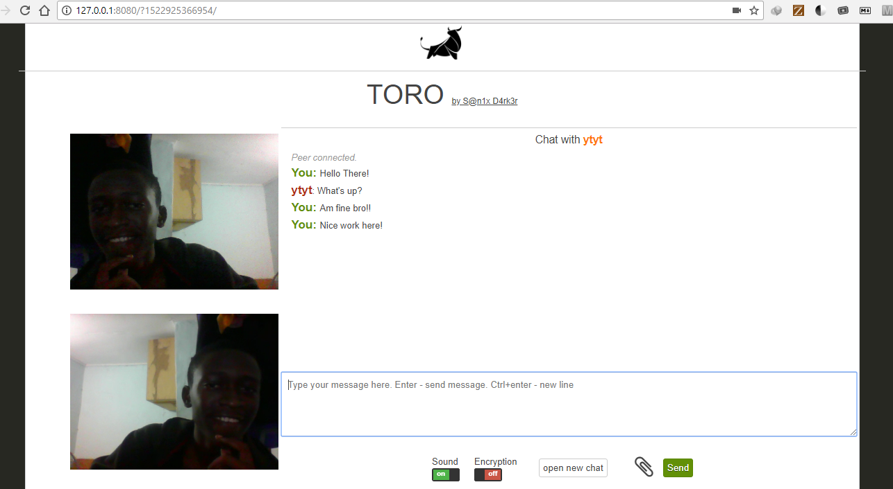

## What is TORO?
TORO is an anonymous peer to peer chat system, *no registration needed*, *no application needed*, *no billings*, *no logs*, *anonymously* and *Encrypted* you just have to share the link to your friend to start the conversation!

## How it work?
A conversation session is created in WebRTC to establish a connection with your pair and an id of your correspondent is generate, it is this id which is transferer in the url

## How to use it?
If you have NodeJs
```cmd
npm install http-server -o

cd C:/path/to/TORO-repository/

http-server -o
```

If you have Wamp
```python

# Put the repository in your C:/Wamp/www
# Launch it via http://127.0.0.1/TORO/

```

## What you only need to do?
```python
# Copy the link
# Share it to your peer

```

## Technologies used:
> ORT (Off the Record messaging protocol) Encryption
> WebRTC

## Authors / Contributors:
<a href="https://github.com/Sanix-Darker">> Sanix Darker </a>

## A Capture of demo in two chrome session:

